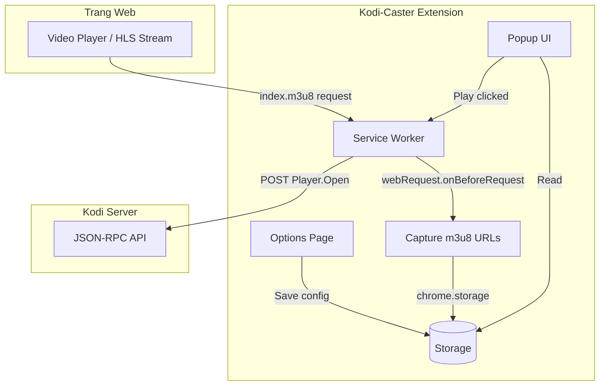
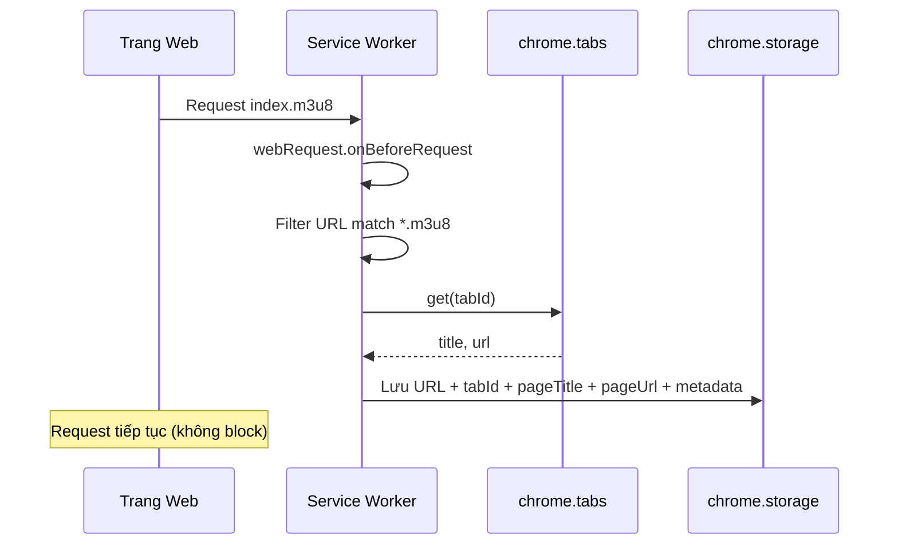
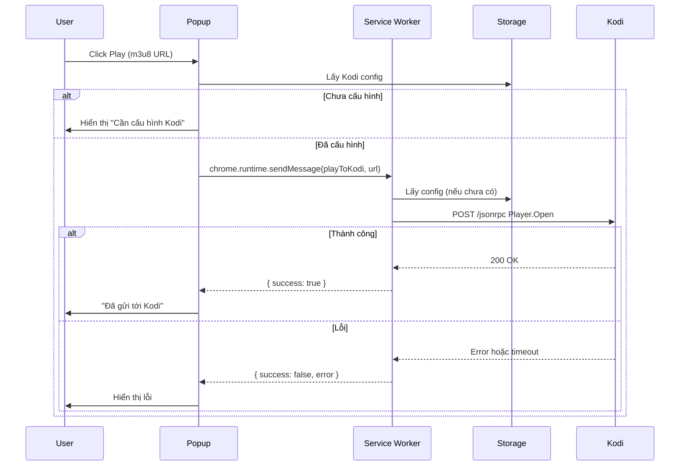
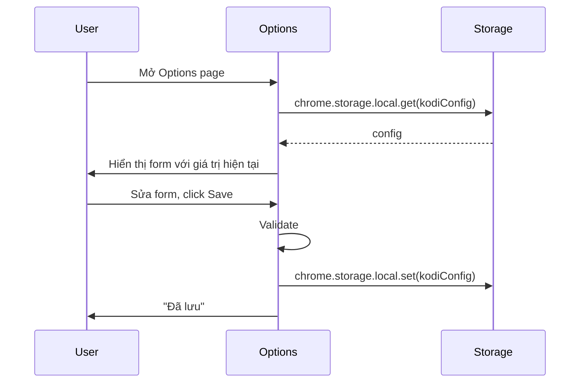

# Kiến trúc Kodi-Caster Extension

## 1. Tổng quan kiến trúc

Kodi-Caster là Chrome Extension Manifest V3 với kiến trúc đơn giản: Service Worker xử lý logic chính (capture, Kodi API), Popup và Options page là giao diện người dùng.



---

## 2. Cấu trúc thư mục

```
kodi-caster/
├── manifest.json
├── background/
│   └── service-worker.js
├── popup/
│   ├── popup.html
│   ├── popup.css
│   └── popup.js
├── options/
│   ├── options.html
│   ├── options.css
│   └── options.js
├── assets/
│   └── icons/
│       ├── icon16.png
│       ├── icon48.png
│       └── icon128.png
├── docs/
│   ├── PROJECT_SPECIFICATION.md
│   ├── ARCHITECTURE.md
│   ├── DATA_MODEL.md
│   ├── API_REFERENCE.md
│   ├── PERMISSIONS.md
│   ├── UI_SPECIFICATION.md
│   └── DEVELOPMENT_GUIDE.md
└── README.md
```

---

## 3. Các thành phần và trách nhiệm

### 3.1 Service Worker (`background/service-worker.js`)

**Vai trò**: Thành phần chính xử lý logic extension.

**Trách nhiệm**:

| Chức năng | Mô tả |
|-----------|-------|
| Capture m3u8 | Đăng ký `chrome.webRequest.onBeforeRequest` với filter URL `*://*/*.m3u8*`, `*://*/*index.m3u8*` |
| Lưu stream | Khi bắt được URL, lưu vào `chrome.storage.session` (hoặc local) với deduplication |
| Xử lý Play | Lắng nghe `chrome.runtime.onMessage` với action `playToKodi`, đọc config, gọi Kodi JSON-RPC |
| Gọi Kodi API | `fetch` POST tới `http://host:port/jsonrpc` với body Player.Open và header `Authorization: Basic` (nếu có auth) |
| Lấy page title/URL | Khi capture, `chrome.tabs.get(tabId)` để lưu `pageTitle`, `pageUrl` vào stream |

**Lưu ý**: Service Worker trong MV3 có thể bị terminate khi idle. Cần đảm bảo logic khởi tạo webRequest listener khi extension load.

### 3.2 Popup (`popup/`)

**Vai trò**: Giao diện nhanh khi user click icon extension.

**Trách nhiệm**:

| Chức năng | Mô tả |
|-----------|-------|
| Hiển thị danh sách | Đọc `capturedStreams`, sắp xếp cũ nhất trước (mới nhất ở cuối), đánh số 1, 2, 3… |
| Mỗi item | Tiêu đề trang (`pageTitle` hoặc fallback), link stream (URL m3u8 clickable), nút Play, nút Xóa |
| Nút Play | Gửi message `playToKodi` tới Service Worker |
| Xóa một item / Xóa tất cả | Popup ghi lại `chrome.storage.session` (lọc bỏ id hoặc set `[]`) |
| Link Options | Nút/link mở Options page |
| Thông báo | Toast success/error sau khi gọi Kodi |
| Empty state | Hiển thị khi chưa có stream, chưa cấu hình Kodi |

**Lifecycle**: Popup đóng khi user click ra ngoài. Cần load data mỗi khi mở.

### 3.3 Options Page (`options/`)

**Vai trò**: Cấu hình Kodi server.

**Trách nhiệm**:

| Chức năng | Mô tả |
|-----------|-------|
| Form cấu hình | Input host, port, username, password |
| Lưu | Ghi vào `chrome.storage.local` |
| Load | Đọc config hiện tại khi mở trang |
| Test connection | Gửi request thử (ví dụ JSON-RPC Ping hoặc Player.GetActivePlayers) tới Kodi |
| Validation | Kiểm tra host, port hợp lệ |

### 3.4 Storage

**Chia sẻ giữa**: Service Worker, Popup, Options.

| Key | Storage Area | Mô tả |
|-----|--------------|-------|
| `kodiConfig` | `chrome.storage.local` | Cấu hình Kodi (host, port, username, password) |
| `capturedStreams` | `chrome.storage.session` hoặc `local` | Mảng các stream đã bắt (url, tabId, timestamp, initiator, pageTitle, pageUrl) |

---

## 4. Data Flow

### 4.1 Luồng Capture m3u8



### 4.2 Luồng Play to Kodi



### 4.3 Luồng Cấu hình



---

## 5. Message Protocol

Giao tiếp giữa Popup và Service Worker qua `chrome.runtime.sendMessage`:

| Action | Payload | Response |
|--------|---------|----------|
| `playToKodi` | `{ url: string }` | `{ success: boolean, error?: string }` |

**Ví dụ**:

```javascript
// Popup gửi
chrome.runtime.sendMessage({ action: 'playToKodi', url: 'https://example.com/stream/index.m3u8' }, (response) => {
  if (response?.success) {
    showSuccess();
  } else {
    showError(response?.error || 'Unknown error');
  }
});
```

```javascript
// Service Worker nhận
chrome.runtime.onMessage.addListener((message, sender, sendResponse) => {
  if (message.action === 'playToKodi') {
    playToKodi(message.url).then(sendResponse);
    return true; // async response
  }
});
```

---

## 6. URL Filter cho webRequest

```javascript
const m3u8Filter = {
  urls: [
    '*://*/*.m3u8*',
    '*://*/*index.m3u8*'
  ]
};

chrome.webRequest.onBeforeRequest.addListener(
  handleM3u8Request,
  m3u8Filter
  // Không dùng ['blocking'] - chỉ observe
);
```

**Lưu ý**: Chrome match pattern `*://*/*.m3u8` có thể không match `index.m3u8` vì dấu `*` trước `.m3u8` chỉ match một segment. Dùng `*://*/*.m3u8*` hoặc nhiều pattern để cover các biến thể.
